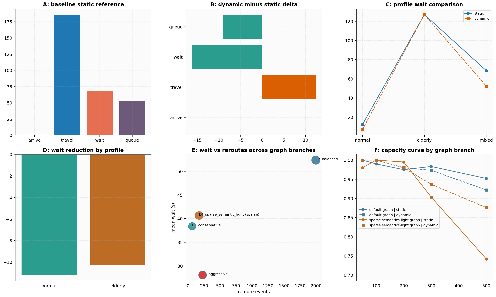
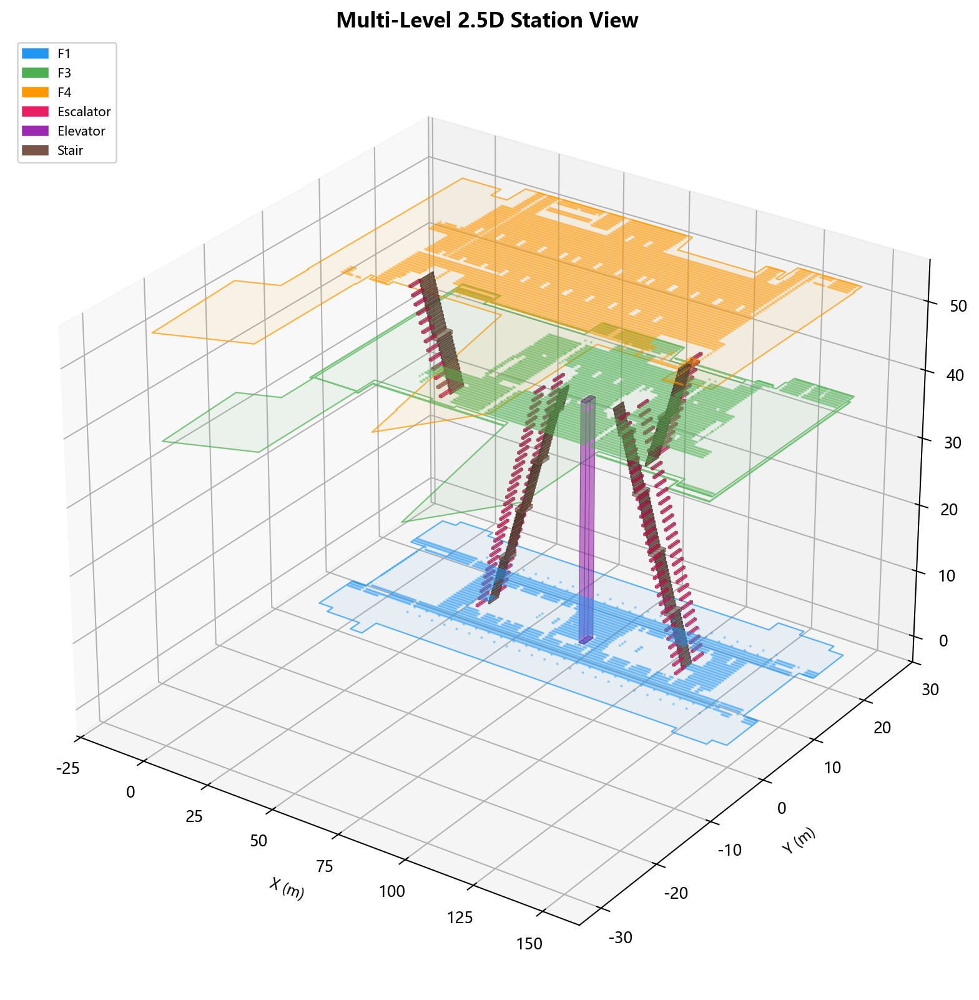
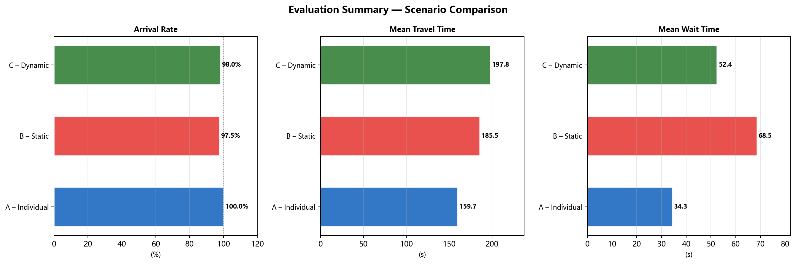
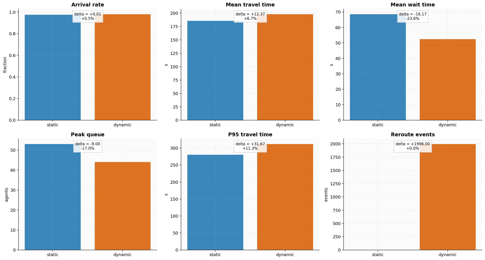

# TUD-Station: LLM Navigation Agent for Urban Rail Transit Stations

[](https://suewang291826.github.io/tud-thesis-showcase/)
[](https://github.com/SueWang291826/tud-thesis-showcase/actions/workflows/pages.yml)
[](https://www.python.org/)
[](https://git-lfs.com/)
[](https://suewang291826.github.io/tud-thesis-showcase/)

End-to-end MSc thesis project that turns IFC BIM station models into a multi-level navigation graph, congestion-aware routing and simulation framework, and a conversational LLM navigation agent. The repository combines reproducible research code, thesis-grade figures, and a public GitHub Pages showcase in one place.

## Quick links

- [Live showcase website](https://suewang291826.github.io/tud-thesis-showcase/)
- [Chapter 6 experiment logic](https://suewang291826.github.io/tud-thesis-showcase/results.html#chapter6)
- [Experiment framework](experiment/README.md)
- [IFC preprocessing pipeline](data-preprocessing/README.md)
- [Repository citation metadata](CITATION.cff)



## Why this repository exists

- It preserves the full thesis workflow from IFC audit and preprocessing to routing, simulation, evaluation, and LLM tooling.
- It keeps research logic and public communication aligned: the code, the Chapter 6 experiments, and the deployed website all reflect the same evaluation structure.
- It tracks the original IFC station models with Git LFS while excluding runtime artifacts and private local configuration.

## Project highlights

- Four-level station model with public floors and connector-only intermediary geometry.
- 2.5D navigation graph with typed stairs, escalators, elevators, fare gates, and obstacle-aware node sampling.
- Agent-based pedestrian simulation with static, dynamic, and accessibility-oriented scenarios.
- LLM navigation layer with tool calling, regex fallback, ChromaDB RAG, and FAISS node indexing.
- Public-facing static site that documents the system, figures, and thesis narrative.

## Screenshots

| Station geometry | Evaluation dashboard | Chapter 6 static vs dynamic |
| --- | --- | --- |
|  |  |  |

## Repository map

### `data-preprocessing/`

Thesis-grade IFC preprocessing pipeline for schema audit, storey alignment, semantic classification, proxy review, geometry checks, and export of clean intermediate datasets.

### `experiment/`

Main experiment framework for geometry extraction, node sampling, graph construction, routing, simulation, evaluation, and the LLM navigation agent.

### `data0/`

Original IFC source files tracked with Git LFS because they exceed standard GitHub file size limits.

### `site/`

Static GitHub Pages website that presents the architecture, graphs, simulation results, and Chapter 6 evaluation logic.

## Chapter 6 experiment logic

The evaluation is organized as a six-experiment chain rather than a flat benchmark table.

| Experiment | Thesis role | What it establishes |
| --- | --- | --- |
| A | Baseline static reference | Defines the no-rerouting reference for arrival, travel, waiting, and queue metrics. |
| B | Dynamic minus static comparison | Measures what congestion-aware replanning changes relative to the baseline. |
| C | Single-profile comparison | Isolates how profile differences behave under static and dynamic routing. |
| D | Mixed-agent simulation | Reintroduces heterogeneous populations to test system behavior under more realistic composition. |
| E | Algorithm-threshold sensitivity | Varies replanning thresholds and congestion parameters to reveal policy trade-offs. |
| F | Capacity / load threshold test | Pushes graph branches and routing modes toward breakdown under rising demand. |

This Chapter 6 structure is summarized in the public site and backed by reusable figures such as [site/img/ch6_pipeline_outputs.png](site/img/ch6_pipeline_outputs.png), [site/img/ch6_static_dynamic_comparison.png](site/img/ch6_static_dynamic_comparison.png), and [site/img/ch6_overall_findings_summary.png](site/img/ch6_overall_findings_summary.png).

## Quick start

### 1. IFC preprocessing

```bash
cd data-preprocessing
pip install -r requirements.txt
python -m src.pipeline
```

### 2. Main experiments

```bash
cd experiment
pip install -r requirements.txt
python pipeline/scripts/run_pipeline.py
```

### 3. Chapter 6 experiment batch

```bash
cd experiment
python scripts/run_ch6_experiments.py --skip-existing
```

### 4. Local website preview

```bash
cd site
python -m http.server 8080
```

Then open [http://localhost:8080](http://localhost:8080).

## Reproducibility notes

- The IFC inputs in `data0/` are versioned with Git LFS.
- Runtime outputs, archives, local environments, and private `.env` files are intentionally excluded from version control.
- The deployed Pages site publishes the `site/` directory directly through GitHub Actions.

## Repository structure

```text
.
├── CITATION.cff
├── data-preprocessing/
├── data0/
├── experiment/
├── site/
└── outputs/                # local generated outputs, not tracked
```

## Citation

GitHub now exposes citation metadata for this repository through [CITATION.cff](CITATION.cff). If you cite the repository directly, you can use the following BibTeX entry:

```bibtex
@misc{wang2025tudstation,
  title = {TUD-Station: LLM Navigation Agent for Urban Rail Transit Stations},
  author = {Wang, Sue},
  year = {2025},
  note = {TU Delft MSc thesis project},
  howpublished = {GitHub repository},
  url = {https://github.com/SueWang291826/tud-thesis-showcase}
}
```

If you are citing the thesis rather than the repository, keep the project title but replace the entry type and publication metadata with the final thesis record used by TU Delft.
